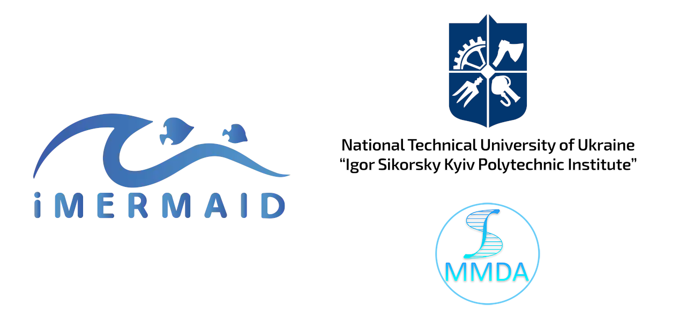

# iMermaid project: Oil spill detection using LinkNet



Developed by Department of Mathematical Modelling and Data Analysis ([MMDA](https://mmda.ipt.kpi.ua/en/)) of the National Technical University of Ukraine “Igor Sikorsky Kyiv Polytechnic Institute” ([NTUU KPI](https://kpi.ua/en)) within the iMermaid project.

## Environment

You can create environment using commands below, where ENVIRONMENT is environment_cpu.yaml (CPU only) or environment_cuda.yaml (NVIDIA GPU):

```
conda env create -f ENVIRONMENT.yaml
conda activate oilspills
conda install -c conda-forge albumentations=1.3.1
```

## Dataset

Latest version of the oil spill detection dataset can be found at: [link](https://drive.google.com/file/d/1E3iNuRz1TKqy1MAcs8D_sUsh30U6HvZe/view?usp=sharing).

## Citation

If you find our work useful in your research, please consider citing it:

```
@article{KUSSUL2025100081,
title = {Transfer learning and single-polarized SAR image preprocessing for oil spill detection},
journal = {ISPRS Open Journal of Photogrammetry and Remote Sensing},
volume = {15},
pages = {100081},
year = {2025},
issn = {2667-3932},
doi = {https://doi.org/10.1016/j.ophoto.2024.100081},
url = {https://www.sciencedirect.com/science/article/pii/S2667393224000255},
author = {Nataliia Kussul and Yevhenii Salii and Volodymyr Kuzin and Bohdan Yailymov and Andrii Shelestov}
}
```